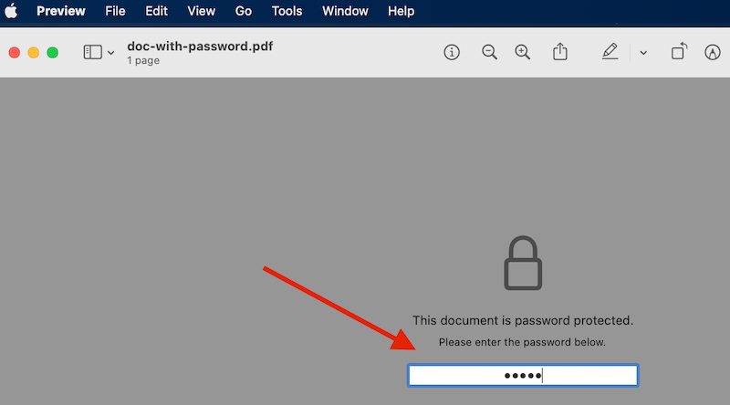
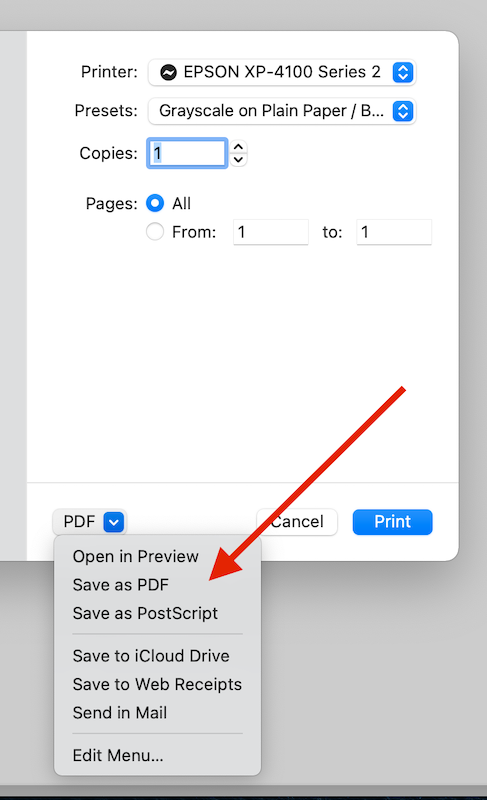

If a PDF document has a password, it can be handy to remove that password permanently.

On MacOS,

1. Open the document in the Preview app.
2. Enter the password.

  

3. From the Preview menu, Select File > Print.
4. Select the PDF dropdown, and save the document.
5. The resulting new document will not have a password.

  
